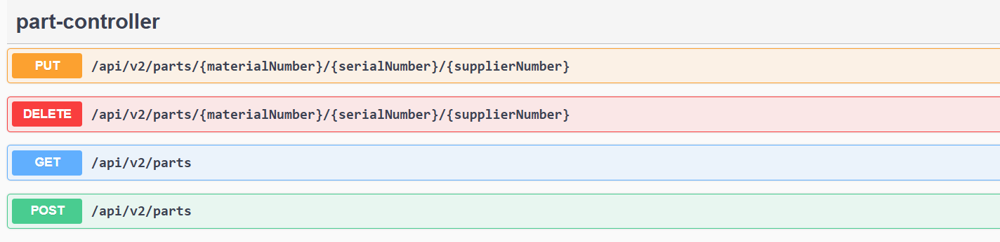

# Project: PartsManagementService

"Simply microservice for parts management"
Microservice that stores information about the number of parts in the warehouse. 

## Contents

1. [Description](#description)
2. [Functions](#functions)
3. [Technology](#technology)
4. [Instalation](#instalation)
5. [Licence](#licence)

## Description

The microservice was written in Java and Spring Boot.  The microservice will display a REST API that allows you to: add parts to the warehouse, retrieve parts from the warehouse, and change the number of parts.  

The warehouse status is saved to the Postgres database.

The microservice logs the most important information. Logging is configured exclusively to a file. 

The microservice contains unit tests to check its functionality.

## Functions



### 1. **Add a part to the warehouse**

-   **Method:** `POST`
    
-   **URL:** `/api/v2/parts`

-   **Description:** Adds a new part to the warehouse.

### 2. **Delete a part from the warehouse**

-   **Method:** `DELETE`
    
-   **URL:** `/api/v2/parts/{materialNumber}/{serialNumber}/{supplierNumber}`

-   **Description:** Deletes a part from the warehouse by its ID.

### 3. **Get all parts from the warehouse**

-   **Method:** `GET`
    
-   **URL:** `/api/v2/parts`

-   **Description:** Retrieves a list of all parts in the warehouse.

### 4. **Update the quantity of the part**

-   **Method:** `PUT`
    
-   **URL:** `/api/v2/parts/{materialNumber}/{serialNumber}/{supplierNumber}`

-   **Description:** Updates the quantity of a part in the warehouse. Required new quantity value to update. 

## Technology

List of technologies used in the project:
- Java 17
- Spring Boot
- PostgreSQL / H2 Database
- Docker
- Mockito
- Lombok

## Instalation

Instructions on how to install and run the project locally.

1. **Clone repo**:
   ```bash
   git clone https://github.com/[username]/PartsManagementService.git

To run the microservice in a Docker container, follow these steps:

1. **Build the app and docker image**
   ```bash
   mvn clean package
   docker-compose build
   
 2. **To run and stop the container**
    ```bash
    docker-compose up -d
    docker-compose down

## Licence

MIT License
Copyright (c) 2025 FalanaJ
